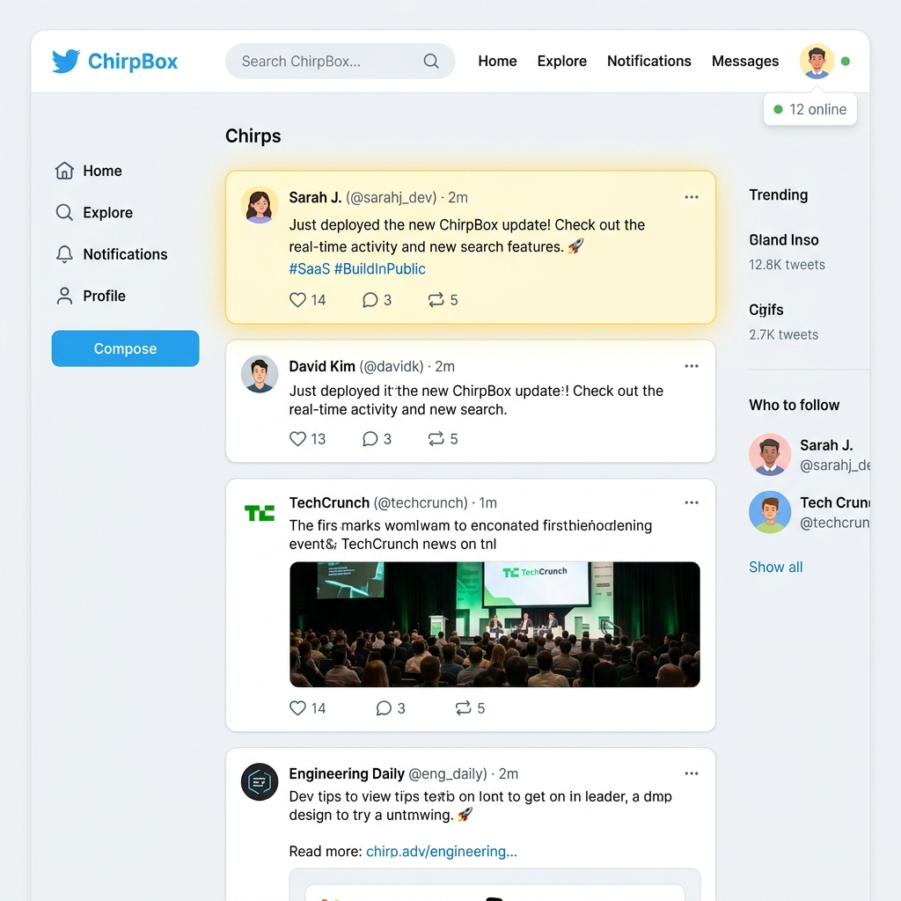

# 🚀 ChirpBox — A Real-Time Microblogging Platform

ChirpBox is a modern, lightweight microblogging application built on Laravel 12. It goes beyond a simple CRUD app by featuring real-time WebSockets interactions, interactive profile customization, user-to-user follows, likes, threaded replies, and full-text search.



---

## 📌 Features

### ⚡ Real-Time Interactions (WebSockets)
* **Live Feed Broadcasting**: Newly posted chirps are prepended live to the home feeds of active users without page refreshes, styled with a glowing yellow highlight animation that fades out.
* **Instant Likes Counts**: Likes and unlikes are updated in real-time on all active screens dynamically using Vue/Alpine-like vanilla JS.
* **Online Presence Counter**: Shows a pulsing indicator displaying how many users are currently active on the platform.

### 📝 Chirp Features & Threaded Replies
* **Full CRUD Control**: Post, edit, and delete chirps.
* **Conversation Threads**: Users can click "Replies" on any chirp to view full chronological conversation detail threads and reply directly.

### 👥 Follow System & Feed Customization
* **User-to-User Follows**: Follow and unfollow other users to customize your feed.
* **Filtered Feed**: Easily toggle the feed between **All Chirps** and **Following Only** tabs.

### 👤 Profiles & Custom Avatars
* **Public Profiles**: Public endpoints `/users/{user}` displaying join dates, total chirps count, followers, following, and a paginated list of their chirps.
* **Avatar Uploads**: Edit Profile settings to upload customized avatars stored securely via Laravel's local public storage, falling back to a cloud placeholder generator when no avatar is set.

### 🔍 Keyword Search
* **Search Engine**: Search bar integrated into the navigation layout matching chirp message content or author names with high-performance LIKE SQL queries.

### 🔐 Authorization & Security
* **Strict Ownership Policies**: Enforced via dedicated Laravel Policies. Users can only edit or delete their own chirps.
* **Form Request Validation**: Offloaded controller validations into decoupled `StoreChirpRequest` and `UpdateChirpRequest` layers.

---

## 🧠 Architectural Decisions

### 1. Laravel Policies for Authorization
We decoupled business access logic from controller actions by introducing **Laravel Policies** (`ChirpPolicy`). This pattern:
* Avoids repetitive ownership `if-checks` within controller actions.
* Simplifies security audit points by isolating who can update/delete a model inside one class.
* Easily intercepts authorization hooks at the form request validation level.

### 2. Laravel Reverb for Real-Time WebSocket Broadcasting
We used **Laravel Reverb** as the WebSocket broadcaster because:
* It is a **first-party, pure PHP WebSocket server** designed to integrate out-of-the-box with Laravel 11/12.
* It eliminates reliance on third-party SaaS broadcasters (like Pusher) or external Node.js websocket wrappers (like Socket.io).
* It offers raw speed and minimal setup overhead while remaining fully compatible with Laravel Echo.

---

## 🛠️ Tech Stack
* **Framework**: Laravel 12 (PHP 8.2+)
* **Styling**: TailwindCSS 4 & DaisyUI 5 (Clean theme design system)
* **Real-time**: Laravel Reverb & Laravel Echo
* **Database**: MySQL / SQLite (Isolation DB Testing support)

---

## ⚙️ Installation & Setup

1. **Clone the repository**:
   ```bash
   git clone https://github.com/HirenPatel555/chirpbox.git
   cd chirpbox
   ```

2. **Install composer and npm dependencies**:
   ```bash
   composer install
   npm install
   ```

3. **Configure environment**:
   ```bash
   cp .env.example .env
   php artisan key:generate
   ```

4. **Connect storage symlink**:
   ```bash
   php artisan storage:link
   ```

5. **Run migrations and seeders**:
   ```bash
   php artisan migrate --seed
   ```

---

## 🚀 Running Locally

To run the application locally with WebSockets fully functional, open three terminal sessions:

* **Terminal 1: Serve the Laravel App**
  ```bash
  php artisan serve
  ```

* **Terminal 2: Run frontend assets compiler**
  ```bash
  npm run dev
  ```

* **Terminal 3: Start the Reverb WebSocket server**
  ```bash
  php artisan reverb:start
  ```

Once running, navigate to `http://localhost:8000`. Register multiple accounts (or open an incognito window) to test real-time broadcasting and active presence counting!

---

## 🧪 Testing

To run the complete test suite:
```bash
php artisan test
```
The test suite covers:
* Strict Policy ownership verification checks.
* Follow/unfollow and feed filtering features.
* Liking/unliking and thread replies assertions.
* Real-time `ChirpCreated`/`ChirpLiked` event broadcasting payloads.
